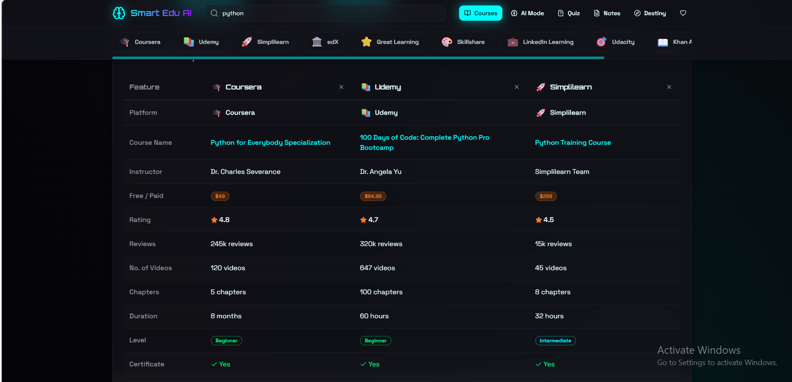

Project Overview
Smart Edu AI is a web-based application designed to help users identify and choose the best e-learning courses across multiple platforms. Many learners face difficulty in deciding which platform offers the most suitable course for a specific topic. This system solves that problem by bringing together course information from platforms like Coursera, Udemy, and Simplilearn into a single interface for easy comparison and decision-making.

Problem Statement
There are many e-learning platforms available today, but:

Course quality varies across platforms

Pricing differs (free vs paid)

Course content and instructors are not easily comparable

Users spend a lot of time switching between platforms

Smart Edu AI provides a centralized solution to compare and analyze courses efficiently.

### Project Screenshots

**Home Page**

**AI Mode**

**Comparison**

**Course Searching**

**Destiny Finder**

**Full Overview**

**Notes Making**

**Quiz Page**

Objectives

To provide a unified platform for course comparison

To help users select the best course based on their needs

To integrate AI-based assistance for learning support

To enhance user experience with additional features like quizzes and notes

Key Features
1. Course Search and Aggregation

Users can search for any topic such as DBMS, Python, or Java.
The system retrieves and displays courses from 10 different e-learning platforms in a horizontal layout.

2. Course Comparison

Users can select 2–3 courses and compare them in a structured table based on:

Course name

Instructor

Free or paid

Number of videos

Topics covered

This helps users make informed decisions.

3. AI Mode

The platform includes an AI-based chat module where users can:

Ask study-related questions

Get concise explanations

Interact through a chat interface

The AI is implemented using rule-based logic and keyword matching.

4. Quiz Generation

Users can generate quizzes for any topic:

Multiple-choice questions

Instant feedback with explanations

Final score dashboard

5. Notes Management

Users can save notes after completing a course

Supports text and voice input (Tamil and English)

Notes are stored with date and course name

Notes can be viewed and downloaded

6. Destiny Checker (Career Guidance)

Users can enter their career goal (e.g., Data Analyst).
The system suggests:

Required skills

Recommended courses from different platforms

A structured learning path

Technologies Used

Frontend

React

Tailwind CSS

Backend

Node.js

Express.js

Database

SQLite / Local JSON storage

Algorithms Used

Inverted Index for fast course search

TF-IDF for keyword-based matching

Hashing for quick data retrieval

B-Tree indexing for efficient querying

System Architecture

User Interface (React Frontend)
↓
Application Logic (Node.js + Express)
↓
Local Data Storage (JSON / SQLite)

Project Structure
smart-edu-ai/
├── frontend/
│   ├── src/
│   ├── components/
│   ├── pages/
│   ├── data/
│   └── styles/
├── backend/
│   ├── routes/
│   ├── controllers/
│   └── data/
├── package.json
├── README.md
Installation and Setup

Clone the repository
git clone https://github.com/kaviya-sharon14/smart-edu-ai.git

Open the folder in VS Code

Install dependencies
npm install

Run the project
npm run dev
or
npm start

Open in browser
http://localhost:3000

How It Works

User enters a course topic in the search bar

The system retrieves relevant courses from local data

Courses from 10 platforms are displayed

User selects courses and compares them

User can explore details and redirect to original platform

AI mode helps with learning queries and quizzes

Notes and career guidance features enhance learning experience

Advantages

Saves time by avoiding multiple platform searches

Provides structured comparison

Works offline (no external APIs required)

Includes learning support tools (AI, quizzes, notes)
